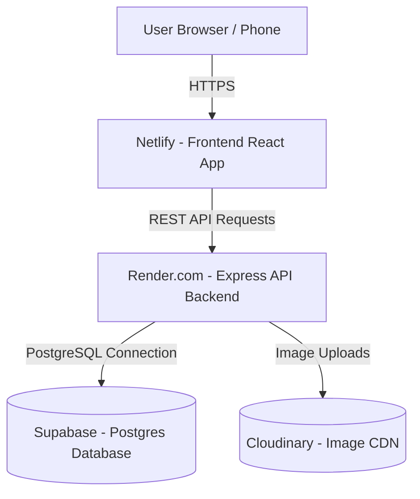

# 🚀 100% Free Production Hosting Guide

This guide explains how to host the complete **Tailoring Management Platform** for **$0 / month** using free-tier cloud providers:

1. **Frontend (React + Vite)** $\rightarrow$ Hosted free on **Netlify**
2. **Backend (Express + Node.js)** $\rightarrow$ Hosted free on **Render.com**
3. **Database (PostgreSQL)** $\rightarrow$ Hosted free on **Supabase** *(Already connected!)*
4. **Media Storage (Company Logos)** $\rightarrow$ Hosted free on **Cloudinary** *(Already connected!)*

---

## Architecture Overview



---

## STEP 1: Deploy Backend to Render.com (100% Free)

**Render** allows you to host Express Node.js backend Web Services for free with automatic SSL/HTTPS certificates and GitHub auto-deployments.

### Steps:
1. Push your project code to a **GitHub repository**.
2. Go to **[Render.com](https://render.com/)** and sign up for a free account.
3. Click **New +** $\rightarrow$ **Web Service**.
4. Connect your GitHub repository.
5. Set the configuration details:
   - **Name**: `tailoring-backend-api`
   - **Root Directory**: `backend`
   - **Environment**: `Node`
   - **Build Command**: `npm install && npm run build && npx prisma generate`
   - **Start Command**: `node dist/server.js`
   - **Instance Type**: `Free`
6. Add **Environment Variables** under Render Settings:
   - `DATABASE_URL` = *(Your Supabase transaction pooler URL)*
   - `DIRECT_URL` = *(Your Supabase direct connection URL)*
   - `JWT_ACCESS_SECRET` = `your_access_token_secret_key_123`
   - `JWT_REFRESH_SECRET` = `your_refresh_token_secret_key_456`
   - `CLOUDINARY_CLOUD_NAME` = *(Your Cloudinary cloud name)*
   - `CLOUDINARY_API_KEY` = *(Your Cloudinary API key)*
   - `CLOUDINARY_API_SECRET` = *(Your Cloudinary API secret)*
   - `PORT` = `5000`
7. Click **Create Web Service**. Render will build and deploy your Express backend.
8. Copy your backend live URL (e.g. `https://tailoring-backend-api.onrender.com`).

---

## STEP 2: Deploy Frontend to Netlify (100% Free)

**Netlify** provides free global CDN web hosting for single-page React applications built with Vite.

### Steps:
1. Go to **[Netlify.com](https://www.netlify.com/)** and sign up / log in.
2. Click **Add new site** $\rightarrow$ **Import an existing project**.
3. Select **GitHub** and authorize Netlify.
4. Choose your repository.
5. Set the build configuration:
   - **Base directory**: `frontend`
   - **Build command**: `npm run build`
   - **Publish directory**: `frontend/dist`
6. Add Environment Variables under **Site configuration** $\rightarrow$ **Environment variables**:
   - `VITE_API_URL` = `https://tailoring-backend-api.onrender.com` *(Replace with your live Render backend URL from Step 1)*
7. Click **Deploy Site**.
8. Netlify will build your Vite React app and give you a free live URL (e.g., `https://my-tailoring-system.netlify.app`).

> [!TIP]
> **Client-Side Routing (`_redirects`)**: We have automatically created `frontend/public/_redirects` with `/* /index.html 200` so page refreshes on sub-routes like `/dashboard/orders` work seamlessly on Netlify!

---

## STEP 3: Initializing Your Production Database

Once both services are live:
1. Run the database seed from your local machine to populate initial default roles and Super Admin credentials:
   ```bash
   cd backend
   npx ts-node prisma/seed.ts
   ```
2. Log in at your live Netlify URL using:
   - **Email:** `admin@tailor.com`
   - **Password:** `Password@123`

---

## Summary of Free Host Resources

| Service | Component | Free Tier Benefits |
|---|---|---|
| **Netlify** | Frontend (React/Vite) | Unlimited bandwidth (100GB/mo), free HTTPS, custom domain support |
| **Render** | Backend (Express/Node) | 512MB RAM, free HTTPS, 750 free execution hours per month |
| **Supabase** | Database (Postgres) | 500MB free PostgreSQL database, direct connections |
| **Cloudinary** | Image CDN | 25 GB free storage & bandwidth for company logos |
